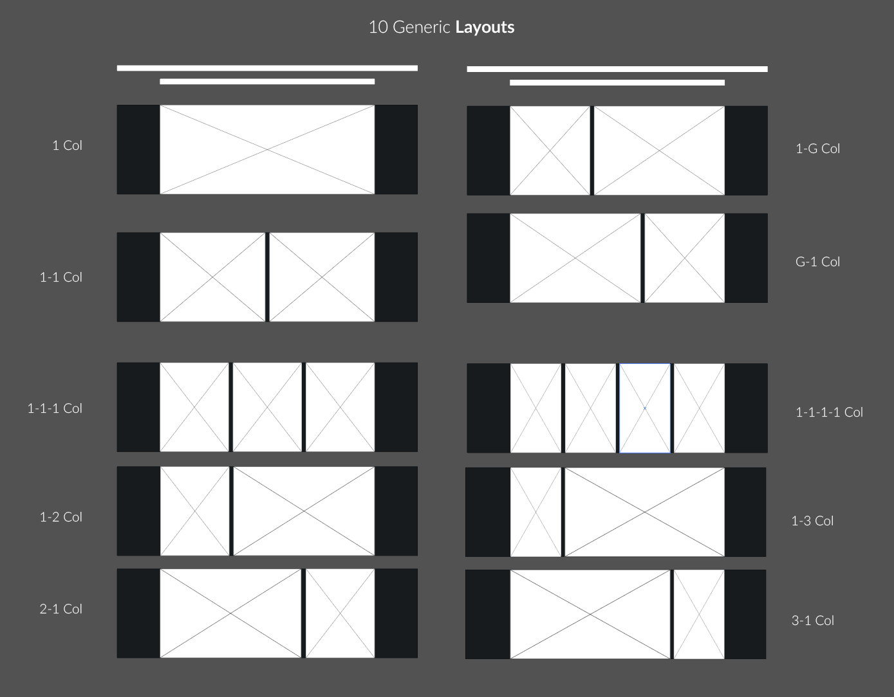
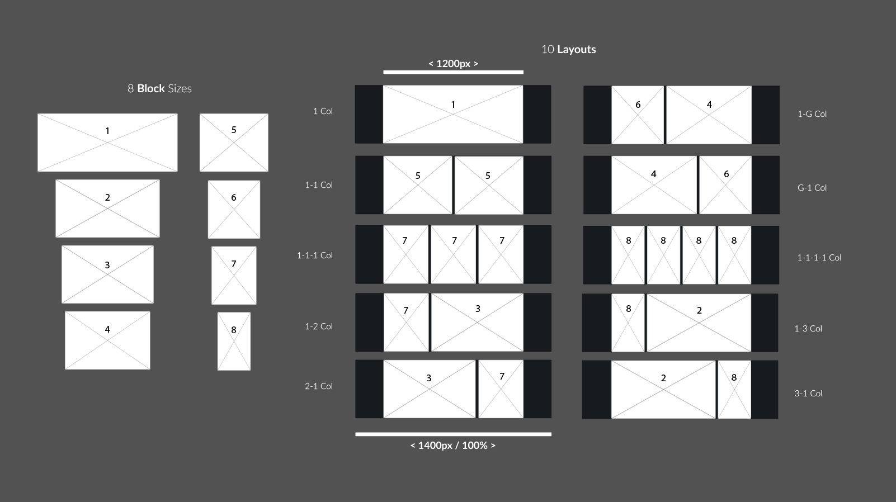
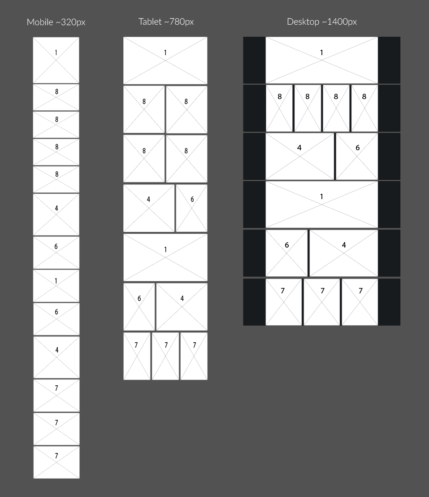

# Documentation


## A Brief Intro to Atomic Design

The layout/templating system used in this theme is intended to be used with our internal design system, inspired by and based on Brad Frost's 'Atomic Design'. To properly understand the thinking behind this system (which will not seem intuitive otherwise) it is worthwhile familiarising yourself with the basics. The introductory article provides enough information to give a background and is about a 10 minute read. Most of what is written below will make very little sense without this as a background. 

Find it here: [http://bradfrost.com/blog/post/atomic-web-design/](http://bradfrost.com/blog/post/atomic-web-design/)

## The 'Unbranded Atomic Design System'

The design system we have chosen differs slightly from the 'default' naming scheme used by Brad Frost, but the logic behind it is fundamentally the same.

Specifically the default 'Atomic' hierarchy:

> Atoms < Molecules < Organisms < Templates < Pages

Becomes:

> Elements < Components < **Blocks** < Layouts < Templates < Pages

The main differences to note are:

* We've dropped the chemistry inspired naming system in favour of something slightly (in our opinion) more self descriptive (Atoms = Elements, Molecules = Components etc.)
* We split the 'Organisms' level into two: 'Blocks' and 'Layouts'. By default, there is just one 'Block' type, which can contain all possible components, but this adds the possibilty of having variations of the default block, which can only use a subset of the components. Which means we can easily design and implement components that don't have to work at every possible block size.

**Don't worry if this is confusing!** This can all be described better visually.

### Layouts & Blocks

'Pages' and 'Templates' should be familiar and self explanatory.

'Layouts' is where things start to need explanation:

If we think of a *Page* or *Template* as being a series of different sections which we scroll through, from top to bottom as we browse. *Layouts* are the horizontal sections which make up that template or page **(layouts are more or less analogous to 'rows' in Bootstrap)**. This is usually simple enough to grasp until we start to think responsively...



In the image above, the 10 most common layouts used in our design system are shown as they would appear at desktop size. The white rectangles are *Blocks* **(analogous to a 'col' in Bootstrap)**.

To take the simplest example, a '1 Col' layout (1 Column), has 1 *Block* in it, and it takes up the full width: `{ width: 100%; }`.

The key thing to understand is that any components built for this block will have to work at a minimum of 320px width (100% width at iPhone 4 size), all the way up to whatever the maximum width of the layout's container is (typically 1200 - 1400px).

**Note - 'Maximum' container width is deliberatly not discussed since it will vary depending on the site and design, wherever possible, we try to work in percentage widths.**

The 1 Col layout is unique in that it's one block will always be 100% width. For all of the rest, depending on the situation, the block widths will probably change at a given break point. Unlike something like Bootstrap, we don't use pre-defined breakpoints. **We do not use pre-defined breakpoints.** 

**We. Do. Not. Use. Pre-defined. Breakpoints.** Don't freak out Bootstrap fans! (you know they never made any sense in the real world).


### Default Layouts

The default layouts can be found in the `/templates/layouts/` directory and any addtional layouts should go here.

To help understand the pattern and how these layouts are ultimately coded - these are all the (desktop) widths  for the blocks in each layout. 

(Note that this pattern is easily extendable. If you wanted a 5 column layout, you could easily make "1-1-1-1-1 Col", with 5 blocks each 100% / 5 = 20% width, or e.g. a 1-1-3 Col layout)

| Layout        | Col/Block 1      | Col/Block 2      | Col/Block 3    | Col/Block 4    |
| ------------- |:----------------:|:----------------:|:--------------:|:--------------:|
| 1 Col         | 100%             | n/a              | n/a            | n/a            |
| 1-1 Col       | 50%  (100/2)     | 50%  (100/2)     | n/a            | n/a            |
| 1-1-1 Col     | 33.33% (100/3)   | 33.33% (100/3)   | 33.33% (100/3) | n/a            |
| 1-1-1-1 Col   | 25% (100/4)      | 25% (100/4)      | 25% (100/4)    | 25% (100/4)    |
| 1-2 Col       | 33.33% (100/3)   | 66.67% (100/3*2) | n/a            | n/a            |
| 2-1 Col       | 66.67% (100/3*2) | 33.33% (100/3)   | n/a            | n/a            |
| 1-3 Col       | 25% (100/4)      | 75% (100/4*3)    | n/a            | n/a            |
| 3-1 Col       | 75% (100/4*3)    | 25% (100/4)      | n/a            | n/a            |
| 1-G Col       | 38.2% (100 - 61.8)| 61.8% (100/1.618)| n/a           | n/a            |
| G-1 Col       | 61.8% (100/1.618)| 38.2% (100 - 61.8)| n/a           | n/a            |

*G = Golden Ratio*


Coming from a grid system like the one in Bootstrap, or Foundation, this may seem a little daunting. It's actually much simpler and in our opinion, more powerful, and more easily extendable. 

Most of the code that forms the basis of this grid system is provided by [PocketGrid](http://arnaudleray.github.io/pocketgrid/) which uses ideas similar to Chris Coyier's '[don't overthink it grids](https://css-tricks.com/dont-overthink-it-grids/)' (it also manages to do this in 43 lines of CSS vs. Bootstrap grid's hundreds of lines, multiple files, mixins, negative margins and excessive markup). Both of the links above are relatively easy reading - building grid systems from scratch will no longer be a mystery to you!

To better understand lets look at some markup:

```
      <div class="wrapper col-1-1-1-1">
        <div class="container col-1-1-1-1__container">
          <div class="block col-1-1-1-1__block block--1">

          </div>
          <div class="block col-1-1-1-1__block block--2">

          </div>
          <div class="block col-1-1-1-1__block block--3">

          </div>
          <div class="block col-1-1-1-1__block block--4">

          </div>
        </div>
      </div>
```

and some SCSS:

```
.col-1-1-1-1 {
    .block {
        width: 100% / 4 * 1;
        @media(max-width: 800px) {
            width: 100% / 2 * 1;
        }
        @media(max-width: 400px) {
            width: 100%;
        }
    }
}

```

> Note: CSS Selector naming scheme uses [BEM syntax](https://csswizardry.com/2013/01/mindbemding-getting-your-head-round-bem-syntax/) where possible, which we recommend checking out if you aren't already familiar with. It is the naming scheme recommended by [Harry Roberts' "CSS Guidelines"](https://cssguidelin.es/) - also an excellent resource we refer to often.

In conjunction with PocketGrid, the above will give you 4 equal columns above 800px viewport width, 2 equal columns between 400px and 800px, and collapse to 1 full width column at 400px width and below.

The beauty of using SASS/SCSS is we can write nice elegant looking SCSS like the above, and simply let SCSS take care of the maths in the percentages for us. CSS does the rest, as it was designed to. No more rows with negative margins!

> Note: Admittedly, this could all be re-written to be 'mobile-first', but within our system, we focus on components which fit in blocks, and it is at the component level where we really need to think 'mobile-first'. There is a tendency for grid columns to end up being 100% width on mobile, regardless of their desktop layout, so when looking at the *Layout* layer, it makes some sense to think 'desktop first'. In practice, prioritising design for mobile vs. desktop is a decision which will be made on a per project basis.


Finally, our *layout* which is actually fully contained within `<div class="container"></div>`, is placed in a 'wrapper' div. The wrapper div will usually be 100% of the viewport width at all screen sizes, and is there to accomodate designs where control of the background is needed outside the container width. Normally the container will sit within it's wrapper, centered using something like: `{ width: 100%; max-width: 1400px; margin: 0 auto; }`


### Default Block

All of our default layouts currently load the default block using the Wordpress function: `get_template_part('templates/blocks/default');`

The file `/templates/blocks/default.php` contains code which enables the user to choose *Components* via ACF Fields in the Wordpress admin backend. The default block simply contains all possible components.

<center></center>

- You can think of the 10 default/base *layouts*, as being built from the 8 possible *block* sizes above.

- Default site *components* should be designed to work at as many *block* sizes as possible. Which means we need to be aware of all of the widths each block can end up being rendered at.

- Some of our *components* might not work at every *block* size, in these cases we can extend our system by separating available components into e.g. a 'narrow' and a 'wide' block, instead of just 'default', these blocks would only contain subsets of components that work at all possible widths *at which that block can occur*. Your layout template would then call e.g. `get_template_part('templates/blocks/wide');` in certain positions and `get_template_part('templates/blocks/narrow');` in others.



## Working with responsive block sizes and components

Once again, this is easier to understand using an example.

First, consider what we already know:

- To be suitable for smaller mobile screens, components need to work at **320px wide**.
- If the max *layout* container width is 1200px, in a 1-1-1-1 Col layout, each ('size 8') block would be **300px wide**. 
- As the viewport is narrowed and gets close to a media query breakpoint (like near 800px in the example SCSS snippet above) our 4 columns in the 1-1-1-1 layout still display '4 accross' horizontally, down to 800px viewport width. At this size the smallest desktop block size works out to approx **200px wide**. 

Based on this information simply designing every possible *component* to work at 200px width, up to 1200px width (i.e. every possible *block* width) would cover all possibilities.

The liklehood of being able to design such flexible *components* that work at all those sizes is obviously quite slim! This is why anything more than very basic component design is something that needs to be thought out carefully **before any code is written** (and why we have a design process in place that puts a strong focus on **wireframing** everything beforehand, even if it is on paper).

Take a look at this simplified wireframe of a *template*, made up of a series of 6 *layouts*:


> (normally a wireframe would include Elements and Components sketched out as well, this is simplified to demonstrate block sizes)

In this example, look at what we can deduce about each block:

| Block Size    | Min Occuring Width | Max Occuring Width |
| :-----------: |:------------------:|:------------------:|
| 1             | 320px              | 1200px             |
| 4             | 320px              | ~740px             |
| 6             | ~300px             | ~460px             |
| 7             | ~260px             | ~400px             |
| 8             | ~300px		       | ~390px             |

To make our life much easier, we could sort these blocks into two groups:

**Group 1:** Blocks 1 - 4, *components* would need to work between 320px - 1200px.

**Group 2:** Blocks 5 - 8, *components* would need to work between 260px - 460px.

You could design different components for each group. Some components could work in both groups, some in just one, you would then duplicate and alter the code in `/templates/blocks/default.php` and the layout templates accordingly, to add or remove the appropriate available components within each block.


##### Important points:

- There will almost always be cases where a component simply can’t work in both groups, or at mobile size and desktop size with the same markup (without extremely hacky css which nobody will understand months later!). After wireframing to scope out what our width limits are likely to be, we should first try to avoid this problem with clever design. When that isn't possible; when we do come to code, we are already at a huge advantage by knowing these cases beforehand. We can just give some components more than one design to cover different width ranges.

	In an example scenario, for a 'Callback Form' component: 
	
	- `/templates/components/callback-form.php` is used in block sizes 1 - 4 (320px - 1200px widths)
	
	- `/templates/components/callback-form--narrow.php` is used in block sizes 5 - 8 (would need to work at 200px - 600px widths)

- Both of those php template files, could even pull in the same ACF fields. The fact there are separate template files can be made imperceptible from within Wordpress admin, it is simply a way for us to have tidy markup/css that adds the correct CSS selectors and is spitting out markup that can be tidily styled to the design.